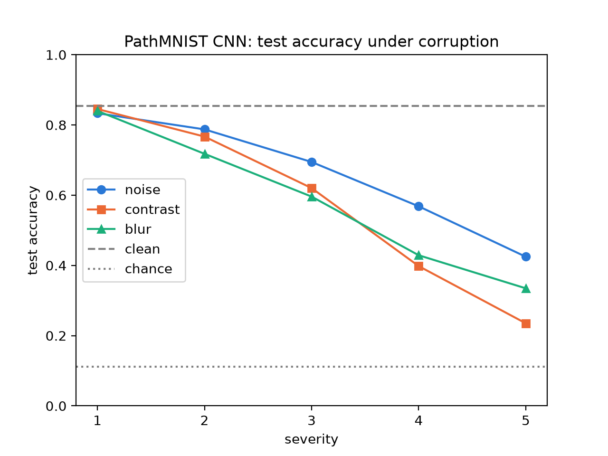

# pathshift

How robust is a CNN pathology classifier to realistic, scanner-like changes in its input images?

This project builds and trains a convolutional neural network based on the LeNet-5 architecture from scratch in PyTorch, on the PathMNIST dataset (90K+ colon histopathology images, 9 classes).

Validation accuracy was 94.2%. Test set accuracy dropped to 85.4%, because the train and validation data come from a different clinical center than the test set data, which may have different data collection methods (staining, scanners, patients).
This showed that shift is present in real world data, so I followed up with a robustness evaluation of the model, writing different corruption functions and testing the model on increasingly severe corrupted images.

## Results

| | Accuracy |
|---|---|
| Validation (clean) | **94.2%** |
| Test (clean) | **85.4%** |

That's an **8.8 point drop** from a real distribution shift (a different clinical center), with no corruption at all.

Then I corrupted the test images with noise, reduced contrast, and blur at 5 severity levels:



| Test accuracy | sev 1 | sev 2 | sev 3 | sev 4 | sev 5 |
|---|---|---|---|---|---|
| Gaussian noise | 83.3% | 78.7% | 69.5% | 56.8% | 42.5% |
| Contrast reduction | 84.5% | 76.7% | 62.0% | 39.8% | 23.5% |
| Gaussian blur | 84.0% | 71.8% | 59.6% | 42.9% | 33.5% |

Chance is 11.1% (1 in 9 classes).

- Accuracy drops pretty linearly for all three corruptions as the severity gets worse.
- Contrast reduction hurts the most at high severity, down to 23.5%, which isn't far off chance.
- The model is very sensitive to noise. At severity 5 the noise has a standard deviation of only 0.06 (on pixels in [0, 1]), which is barely visible, and it still costs over 40 points.
- The real shift already shows up on clean test data. The corruptions are more like a test of a *broken* sensor than a *different* one, so they're a harsher stress test on top of that.

## What I did

### Data

PathMNIST comes as one `.npz` file with train/val/test images and labels. I load it with numpy, convert the images to float32 and divide by 255 so every pixel is in [0, 1], and permute them from (N, 28, 28, 3) to (N, 3, 28, 28), which is the channels-first layout PyTorch conv layers expect. The labels get flattened into one vector of class indices for the loss function. Then everything goes into `TensorDataset`s and `DataLoader`s (batch size 128, only the train loader shuffles).

According to the MedMNIST paper, PathMNIST's train and val images come from NCT-CRC-HE-100K, and the test images come from CRC-VAL-HE-7K, which was collected at a different clinical center. That's why the val/test gap counts as a real distribution shift.

### Starting with an MLP

I started with a simple MLP (2 hidden layers, ReLU) to get the whole pipeline working end to end: data loaders, training loop, evaluation. It got 56.3% validation accuracy. I tuned the learning rate and hidden layer sizes with Optuna, which only got it to 61.9%, so I moved on to a CNN.

### The CNN

A small LeNet-5 style CNN, since the images are only 28x28 and the dataset isn't very complicated:

```
Conv(3 -> 32) -> ReLU -> Conv(32 -> 32) -> ReLU -> MaxPool     28x28 -> 14x14
Conv(32 -> 64) -> ReLU -> Conv(64 -> 64) -> ReLU -> MaxPool    14x14 -> 7x7
Flatten -> Linear(3136 -> 128) -> ReLU -> Linear(128 -> 9)
```

- All the conv layers use 3x3 kernels, stride 1, and `same` padding, so they keep the spatial size the same. Only the pooling layers shrink it.
- Each max pool keeps the biggest value in every 2x2 block, halving the height and width. After each pool I double the channels, since the layers can encode richer features while the image gets smaller.
- The first linear layer takes 7 x 7 pixels x 64 channels = 3136 inputs.
- The output layer gives 9 raw logits with no softmax, because `CrossEntropyLoss` computes the loss straight from the logits.

### Training and evaluation

I wrote the training loop and evaluation function myself:

- `train_one_epoch`: for each batch, forward pass, compute the cross-entropy loss, backward pass, optimizer step, zero the gradients. It prints the average loss for the epoch.
- `evaluate`: puts the model in eval mode, runs every batch under `torch.no_grad()`, and averages the accuracy over the batches (using torchmetrics `Accuracy`, which compares the index of the highest logit to the label).

I tried SGD first, but Adam trained much faster. Final settings: Adam, learning rate 1e-3, batch size 128, 20 epochs, seed 42. The CNN reached 94.2% validation accuracy, way better than the MLP.

`train.py` saves the trained weights to `checkpoints/cnn.pt` and the settings to `checkpoints/config.json`, so `evaluate.py` can load the same model later.

### Robustness eval

I wrote three corruption functions to simulate things that can go wrong with a scanner. Each one takes a batch of images and a severity from 1 to 5:

| Corruption | Simulates | What it does | Severity 1 -> 5 |
|---|---|---|---|
| Gaussian noise | sensor / low-light noise | adds `torch.randn_like` noise, then clamps back to [0, 1] | std 0.02, 0.03, 0.04, 0.05, 0.06 |
| Contrast reduction | staining / exposure differences | pulls every pixel toward its image's mean, per color channel | keeps 85%, 70%, 55%, 40%, 25% of the contrast |
| Gaussian blur | focus problems | torchvision `GaussianBlur` | sigma 0.4, 0.5, 0.6, 0.8, 1.0 |

The evaluation follows a few rules:
- Only the test set gets corrupted. The model was trained and tuned on clean data.
- Each batch gets corrupted in raw pixel space ([0, 1]) before it goes to the GPU.
- Every corruption and severity runs on the same test images, and the seed gets reset before each run so the random noise is identical every time.
- Clean test accuracy is the baseline everything gets compared to.

I picked the severity values on the validation set, so that accuracy drops gradually instead of collapsing between two levels. My first noise levels (std 0.04 to 0.20) sent the model to near chance by severity 3.

## Limitations

- The images are only 28x28, so this is a lot less detail than real pathology slides.
- The corruptions are simple synthetic stand-ins for real scanner problems, not measurements of real ones.
- Every number comes from one training run with one seed, so there are no error bars.
- Severity levels are my own choice (tuned on validation data), so "severity 5" only means something next to the values in the table above.
- The val/test gap mixes everything that differs between the two clinical centers (staining, scanner, patients), so it shows that a shift exists but not what caused it.

## Continuations
To improve on this project, I have a few continuations I'd like to implement.
1. **Data augmentation:** Augment the data using 1 or 2 of the corruption functions and adding corrupted copies to the training set. Then test on the function that the model hasn't seen before. This could plausibly increase accuracy on corrupted images by making the model more resilient to poor quality images. I'd also compare with the validation accuracy, to see if it changed. We could also introduce new corruptions, like colour and stain.
2. **Shift detection with MMD:** In real world scenarios, an issue with the model can go undetected since we have no labels. This leads to misclassifications, a major issue in healthcare scenarios. To detect this, we can compare the model's embeddings of an incoming to a reference set from the validation data using MMD, with large discrepancies raising an alarm. 

## How to run

Requires [uv](https://docs.astral.sh/uv/).

```bash
uv sync                               # install dependencies
uv run python -m pathshift.train       # train the CNN, saves checkpoints/cnn.pt (downloads PathMNIST on first run)
uv run python -m pathshift.evaluate    # clean + corrupted accuracy, writes results/robustness.json and results/robustness.png
```

## Layout

```
src/pathshift/
├── data.py          # loading PathMNIST, data loaders
├── model.py         # the CNN
├── train.py         # training loop, evaluate function, saves the checkpoint
├── corruptions.py   # noise / contrast / blur at severity 1-5
└── evaluate.py      # accuracy for every corruption x severity, and the plot
results/             # robustness.json and robustness.png
```

## References

- Yang et al., *MedMNIST v2: A large-scale lightweight benchmark for 2D and 3D biomedical image classification*, Scientific Data 2023.
- Hendrycks & Dietterich, *Benchmarking Neural Network Robustness to Common Corruptions and Perturbations*, ICLR 2019 (the idea of corruptions at graded severity levels).
